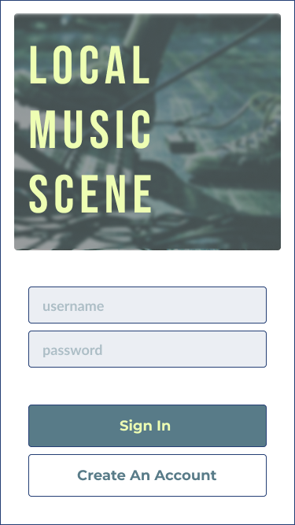

# The Local Music Scene
<a href="#license"></img></a>

## Description
A full-stack application for local underground artists to share music with local residents... without having to go to a live music venue.

### Technologies
- <a href="https://tholman.com/elevator.js/">Elevator.js</a>
- Bcrypt
- Connect Session Sequelize
- dotenv
- Express
- Express Handlebars
- Express Session
- mysql2
- Sequelize

### User Story
AS A musician with a local underground band
I WANT a site where I, other artists, and local residents can uploaded and listen to underground music of local bands
SO THAT the music can still be enjoyed by locals without having to go to a live music venue

## Table of Contents
- <a href="#acceptance-criteria">Acceptance Criteria</a>
- <a href="#installation">Installation</a>
- <a href="#usage">Usage</a>
- <a href="#mock-up">Mock-Up</a>
- <a href="#deployed-application">Deployed Application</a>
- <a href="contributors">Contributors</a>
- <a href="#license">License</a>

## Acceptance Criteria for MVP
_**DRAFT**_
GIVEN a CMS-style music sharing site . . .

WHEN I visit the site for the first time
THEN I am required to choose one of two options in order to access the application:
  - login
  - sign up

WHEN I choose to sign up
THEN I am prompted to create a username and password

WHEN I click on the sign-up button
THEN my user credentials are saved and I am logged into the site

WHEN I revisit the site at a later time and choose to sign in
THEN I am prompted to enter my username and password

WHEN I visit the application after logging in
THEN I am presented with a homepage which includes all songs that have been shared to the site and a sticky button to add a new song

WHEN I get to the bottom of the homepage
THEN there is a button to take an elevator back to the top of the page

WHEN I am on the homepage
THEN I am presented with existing songs that have been published that include the song title, URL to listen, the artist, and the alubum

WHEN I am viewing published songs on the homepage
THEN they are displayed in order of most recently added

WHEN I click on the button to add a new song
THEN I am prompted to enter a title, URL where the song can be listened to, the artist, and the alubm

WHEN I click on the button to submit a new song
THEN the song information is saved and I am taken back to an updated dashboard with the new song at the top

WHEN I click the link to listen to the song
THEN it opens in a new browser window

WHEN I am idle on the site for more than a set time
THEN I am prompted to log in again before I can view or publish songs

### Features for Iteration 2.0
_**DRAFT**_
- Sound storage: upload and play sound files directly from the site
- Filter by location to keep the application truly local
- Favorite songs and access a list of these

## Installation
- Clone the directly from the GitHub repository to your local machine.
- Run _npm init_ in the command line.
- Run _npm i_ to install the dependencies.
- Run the command _node server.js_ to launch the application.

## Usage
To easily share and consume local underground music that is otherwise not readily avaiable in a central location.
## Mock-Up
**Flow chart**

**Color palette**

**Index** where users must login (or sign up) to open the application

**Homepage** where users can view all songs that have been uploaded

**Upload new songs** where artists can published newly released songs

## Deployed Application
Live url: TBD
Repo url: https://github.com/cpm-128/local-music-scene

### Screencapture
**Index** where users must login (or sign up) to open the application

**Homepage** where users can view all songs that have been uploaded

**Upload new songs** where artists can published newly released songs

## Contributors
- <a href="https://github.com/mlmcgeenc">Matt McGee</a>
- <a href="https://github.com/awartani321">Adam Awartani</a>
- <a href="https://github.com/dashley2">Ashley Darr</a>

## License
MIT License

Copyright (c) [2022] [Colleen Maher]

Permission is hereby granted, free of charge, to any person obtaining a copy
of this software and associated documentation files (the "Software"), to deal
in the Software without restriction, including without limitation the rights
to use, copy, modify, merge, publish, distribute, sublicense, and/or sell
copies of the Software, and to permit persons to whom the Software is
furnished to do so, subject to the following conditions:

The above copyright notice and this permission notice shall be included in all
copies or substantial portions of the Software.

THE SOFTWARE IS PROVIDED "AS IS", WITHOUT WARRANTY OF ANY KIND, EXPRESS OR
IMPLIED, INCLUDING BUT NOT LIMITED TO THE WARRANTIES OF MERCHANTABILITY,
FITNESS FOR A PARTICULAR PURPOSE AND NONINFRINGEMENT. IN NO EVENT SHALL THE
AUTHORS OR COPYRIGHT HOLDERS BE LIABLE FOR ANY CLAIM, DAMAGES OR OTHER
LIABILITY, WHETHER IN AN ACTION OF CONTRACT, TORT OR OTHERWISE, ARISING FROM,
OUT OF OR IN CONNECTION WITH THE SOFTWARE OR THE USE OR OTHER DEALINGS IN THE
SOFTWARE.